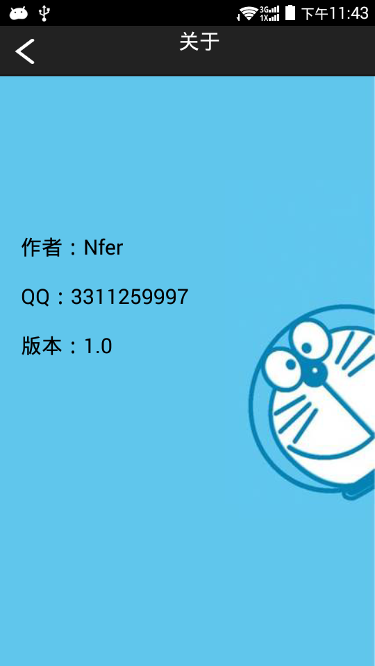

# 下班倒计时

## 简介

按时下班，从我做起

- 如果你不是弹性工作制，那就不用往下看了；
- 如果你不是准点下班的话，那就不用往下看了；
- 如果你不是经常忘记早上打卡时间的人，那就不用往下看了；

使用这款应用可以：
1. 一键记录打卡时间
2. 自动计算下班时间
3. 下班时间自动提醒

## 特点

坚持做一款安安静静的美应用

- 没有任何特殊权限，作为一个极简应用，从不申请任何有风险的权限
- 没有任何广告，向广告骚扰"say no"
- 没有任何后台数据，根本就不申请网络权限，断网使用也可

## 下载地址
- [豌豆荚商店应用页面](http://www.wandoujia.com/apps/com.nferzhuang.offwork)
- [APK下载地址](http://apps.wandoujia.com/apps/com.nferzhuang.offwork/download)

## 截图

